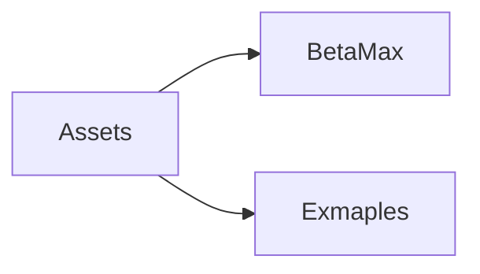
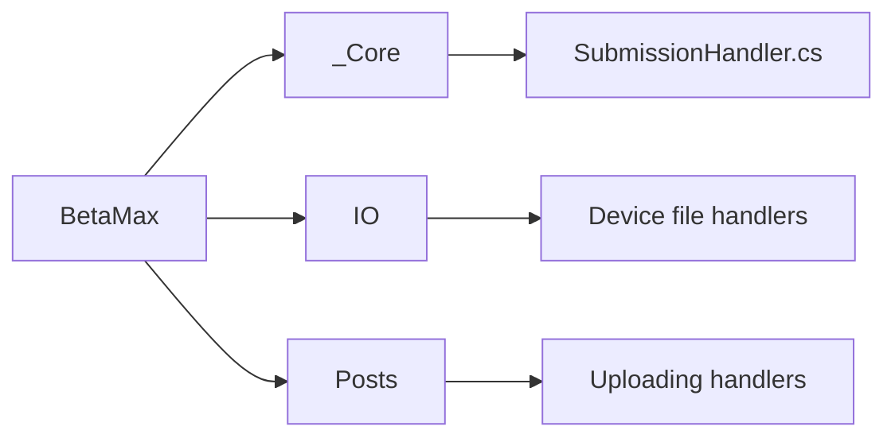
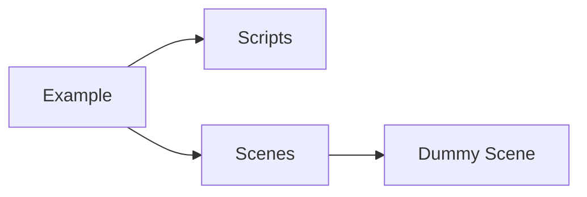
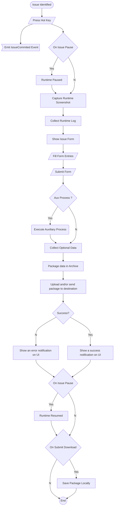

# 

# Table of Contents

* [Description](#description)

* [Screenshots](#screenshots)

* [Features](#features)

* [Unity Folder Structure](#unity-folder-structure)

* [Tool Flowchart](#tool-flowchart)

* [Base Handler](#base-handler)
  
  * [Submission Handler](#the-submission-handler-class)
  
  * [Data Container Structs](#the-data-containers)

* [Dependencies](#dependencies)

# Description

A **Unity3D runtime** tool used for beta testing and issue reporting. It supports the HTTP/HTTPS, FTP, SFTP upload protocols. The user with the press of a button can submit his issue to your server with ease and also provides the user with the functionality of adding additional files to the final zipped file that you will receive and  automatically save a copy of his sent info to his device upon uploading. All of this fully customizable and extensible for your use.

# Screenshots

## UI Examples provided

# Features

## User Persistent Data

The tool provides you and the user with a simple JSON file that can be edited, serialized and saved on the beta tester's device, so no need to re-enter all the needed information every time the user presses the submit button.

## Supported Protocols

The supported protocols: *FTP*, *SFTP*, *HTTP*, *HTTPS*.

***No encryption on the inspector fields is provided, although you can extend this.***

HTTP/S uses ***BasicAuth***.

## UI Examples Included

Inside the package you'll also find a fully setted up and functional UI template which you can freely use and modify to your needs.

Located at [Screenshots](#screenshots)

# Unity Folder Structure

Upon opening the package.

The BetaMax Folder is where the whole tool is contained in. All the essential scripts and plugins are also included in this folder. The single script you'll need will be the **SubmissionHandler** class.

The Examples folder contains a fully functional scene and some example panel scripts so you can have a starting point on how to set up your UI. Although none of the example scripts are needed for the tool.

# Tool Flowchart

# Base Handler

## The Submission Handler class

The SubmissionHandler class (SubmissionHandler.cs) is the main handler of the tool. This is the place where you will set up everything you need for the tool to work properly. From save folders to server info and the screenshot handler.

*Place on a gameObject.*

Below comes the **inspector modifiable** fields and how you can **edit** them.

### File Naming Settings

| Name                | Type   | Field Info                                                                                                                                       |
| ------------------- | ------ | ------------------------------------------------------------------------------------------------------------------------------------------------ |
| Source Folder       | string | The application's configuration main folder name which will be placed inside the AppData of the user.                                            |
| JSON_FILE_NAME      | string | The filename along with its extension of the file containing the user's configuration.                                                           |
| TEMP_FOLDER_NAME    | string | The name of the folder in which the files will get copied to before getting zipped for uploading.                                                |
| USER_OPT_FOLDER     | string | The name of the folder in which the user's optional files will get copied to inside the TEMP_FOLDER_NAME before getting zipped for uploading.    |
| MAIN_ZIP_NAME       | string | The name of the zip you will receive in your server.                                                                                             |
| Main Zip Format     | string | A string used to format the MAIN_ZIP_NAME with the place of the date and the name. Modifiable keywords: {date}, {name} for example {name}_{date} |
| Date Format         | string | The format you want the {date} to be formatted as, for example: dd_MM_yyyy_HH_mm_ss                                                              |
| DOWNLOADED_ZIP_NAME | string | The name of the zip saved locally to the users device. The final name will be formatted as {fixedDateFormat}_{DOWNLOADED_ZIP_NAME}               |

### Submitter Settings

| Name             | Type     | Field Info                                                                                         |
| ---------------- | -------- | -------------------------------------------------------------------------------------------------- |
| Submit Panel Key | KeyCode  | The button that will toggle the submit panel ON/OFF.                                               |
| Config Panel Key | KeyCode  | The button that will toggle the configuration panel ON/OFF.                                        |
| Issue Categories | string[] | The categories of issues that your UI handler can automatically retrieve and feed to the dropdown. |

### Server Info

| Name            | Type   | Field Info                                                                                                                                                 |
| --------------- | ------ | ---------------------------------------------------------------------------------------------------------------------------------------------------------- |
| Hostname        | string | The transfer server URL. The protocol is automatically determined in the handler. **URL Format:** {PROTOCOL}://{address}:{PORT}/{Abs\|Rel path}/{fileName} |
| Server Username | string | The server login username.                                                                                                                                 |
| Server Password | string | The server login password.                                                                                                                                 |

### Screenshot Camera

| Name              | Type         | Field Info                                      |
| ----------------- | ------------ | ----------------------------------------------- |
| Screenshot camera | Unity Camera | The camera that will be used for screenshoting. |

### UI Panels:

| Name                | Type       | Field Info                                                 |
| ------------------- | ---------- | ---------------------------------------------------------- |
| Submission Panel    | GameObject | Reference to the gameObject of the submission panel.       |
| Config Panel        | GameObject | Reference to the gameObject of the configuration panel.    |
| Message Text        | TMP_UGUI   | The UI element used to show tool messages to the interface |
| Close After Seconds | float      | The time which the message text will get displayed for.    |

### Debugging Log

| Name            | Type | Field Info                                              |
| --------------- | ---- | ------------------------------------------------------- |
| Show Debug Logs | bool | Whether to show debug logs or not in the unity console. |

A log file is also created in the runtime and placed inside the TEMP_FOLDER_NAME which logs everything that is happening in the tool, whether or not Show Debug Logs is toggled on.

## The Data Containers

Two structs are used to transfer the panel data to the Submission Handler.

1) ConfigInfo

2) SubmitInfo

The SubmissionHandler must know what field data to serialize and to achieve this a ConfigStruct must be passed to the Submission Handler when it's time to save the user's info.

The submission process follows the same path, when the user wants to upload the data a SubmitInfo struct must be passed to the Submission Handler so the field info can be collected from the interface.

# Dependencies

* **[SSH.NET](https://github.com/sshnet/SSH.NET)**: SSH.NET is a Secure Shell (SSH) library for .NET, optimized for parallelism.
