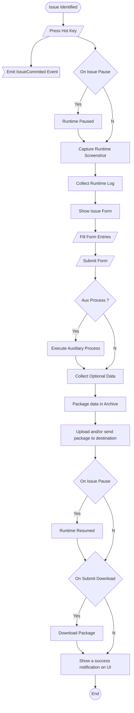

# betmax


### Description
A **Unity3D runtime** tool that will give the option to the beta tester by the hit of a K/B button to immediately show a UI form that he/she will be able to write a subject and description of the issue and by the time he/she will submit it, it will take a screenshot of the captured moment and wrap it up with the current game log and the submitted form on an archive file(zip). Finally it should have various methods to upload the archive(ssh, ftp, http) on a server.

#### Logic



### Supported Protocols

The supported protocols for upload servers should be *FTP*, *SFTP*, *HTTP*, *HTTPS*.

### Inputs
| Name | Type | Description |
|------|------|-------------|
| SubmitHotKey | String | The KeyCode of the hot key that will open the Submission Form. |
| ConfigHotKey | String | The KeyCode of the hot key that will open the beta tester's configuration form. |
| IssueCategories | String[] | An array that will be populated with the *issue categories* of the *submission form*.
| Hostname | String | The address of the server that the package will be uploaded.* |
| Username | String | The username to access the server. |
| Password | String | The password to access the server. |

#### *The Hostname URL
The URL should have the following format... 
{*PROTOCOL*}://{*address*}:{*PORT*}

e.g.
```
ftp://issue.foufoutos.tw:20
sftp://issue.foufoutos.tw:22
http://issue.foufoutos.tw
http://issue.foufoutos.tw:8080
https://issue.foufoutos.tw
https://issue.foufoutos.tw:8084
```

### UI/UX
#### Submission Form
Nothing fancy, a simple UI form that will appear in the middle of the screen immediately when called and hide immediately after the submission.

| Field | Type | Description |
|-------|------|-------------|
| Category | Dropdown | A dropdown with the various issue categories. |
| Description | Text | A text field that will describe the issue. |
| Steps to reproduce | Text | A text field that will contain the steps to replicate the issue. |
| Send | Button | The button that performs the submission of the form. |

#### Configuration Form
Again a simple UI form that will appear in the middle of the screen immediately when called and hide immediately after the submission.
This form will contain some *persistent\** information regarding the Beta tester himself and the PC Box that he is performing the tests.
This form should also be packaged and send together with the **Submission Form**.

> Note: By persistent we mean the information that will have to be submitted only once by the beta tester. This file should be serialized on the runtime
folder of the application for further use.

| Field | Type | Description |
|-------|------|-------------|
| On Issue Pause | Boolean | A boolean that will raise the **On Issue Pause** flag. |
| On Submit Download | Boolean | A boolean that will raise the **On Submit Download** flag. |
| Downloads | Text | An one line text field that will hold the **absolute** path to the folder that the packages will download into. |
| Optionals | Text  | An one line text field that will hold the **absolute** path to the optional files that should also be packaged. |
| Name | Text | An one line text field that will hold name of the issue reporter(Beta tester). |
| OS | Text | An one line text field with that will hold the Operating System of the reporter's BOX.* |
| CPU | Text | An one line text field with that will hold the CPU specs of the reporter's BOX.* |
| RAM | Text | An one line text field with that will hold the RAM specs of the reporter's BOX.* |
| SVGA | Text | An one line text field with that will hold the Graphic Card specs of the reporter's BOX.* |

> *Proposed Automation: It would be great if this field could be filled automatically by the runtime and let the reporter to edit it.
