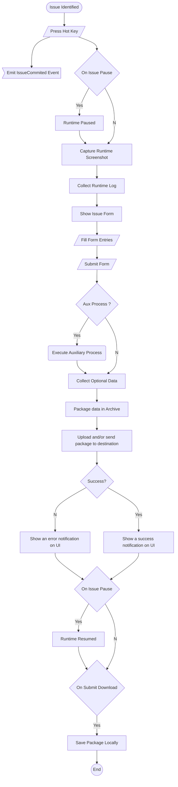

# BetaMax

### Description

A **Unity3D runtime** tool used for beta testing and issue reporting. It supports the HTTP/HTTPS, FTP, SFTP upload protocols. The user with the press of a button can submit his issue to your server with ease and also provides the user with the functionality of adding additional files to the final zipped file that you will receive and  automatically save a copy of his sent info to his device upon uploading. All of this fully customizable and extensible for your use.

# Table of Contents

- [Tool Flowchart](#tool-flowchart)

- [Base Structure](#base-structure)

- [Supported Protocols](#supported-protocols)

- [Base Handlers](#base-handlers)
  
  - [Submission Handler](#the-submission-handler-class)
  
  - [Configuration Panel Handler](#the-configuration-panel-handler)
  
  - [Submission Panel Handler](#the-submission-panel-handler)

- [Further Functionalities](#further-functionalities)
  
  - [IO Folder](#the-io-handlers)
  
  - [Transfer Folder](#the-transfer-handlers)

- [External Tools](#external-tools-used)
  
  - [SSH.NET](#ssh.net)

#### Tool Flowchart

### 

### Supported Protocols

The supported protocols: *FTP*, *SFTP*, *HTTP*, *HTTPS*.

***No encryption on the inspector fields is provided, although you can extend this.***

### Base Structure

The base components of the tool consist of three scripts that must be attached to GameObjects.

* Submission Handler

* Configuration Panel Handler

* Submission Panel Handler

Further Functionalities

1) The IO folder.

2) The Transfer Methods folder.

### Base Handlers

##### The Submission Handler class

The SubmissionHandler class (SubmissionHandler.cs) is the main handler of the tool. This is the place where you will set up everything you need for the tool to work properly. From save folders to server info and the screenshot handler.

*Place on a gameObject.*

Below comes the **inspector modifiable** fields and how you can **edit** them.

###### File Naming Settings

| Name                | Type   | Field Info                                                                                                                                       |
| ------------------- | ------ | ------------------------------------------------------------------------------------------------------------------------------------------------ |
| Source Folder       | string | The application's configuration main folder name which will be placed inside the AppData of the user.                                            |
| JSON_FILE_NAME      | string | The filename along with its extension of the file containing the user's configuration.                                                           |
| TEMP_FOLDER_NAME    | string | The name of the folder in which the files will get copied to before getting zipped for uploading.                                                |
| USER_OPT_FOLDER     | string | The name of the folder in which the user's optional files will get copied to inside the TEMP_FOLDER_NAME before getting zipped for uploading.    |
| MAIN_ZIP_NAME       | string | The name of the zip you will receive in your server.                                                                                             |
| Main Zip Format     | string | A string used to format the MAIN_ZIP_NAME with the place of the date and the name. Modifiable keywords: {date}, {name} for example {name}_{date} |
| Date Format         | string | The format you want the {date} to be formatted as, for example: dd_MM_yyyy_HH_mm_ss                                                              |
| DOWNLOADED_ZIP_NAME | string | The name of the zip saved locally to the users device. The final name will be formatted as {fixedDateFormat}_{DOWNLOADED_ZIP_NAME}               |

###### Submitter Settings

| Name             | Type     | Field Info                                                                                  |
| ---------------- | -------- | ------------------------------------------------------------------------------------------- |
| Submit Panel Key | KeyCode  | The button that will toggle the submit panel ON/OFF.                                        |
| Config Panel Key | KeyCode  | The button that will toggle the configuration panel ON/OFF.                                 |
| Issue Categories | string[] | The categories of issues that the handler automatically feeds to the submit panel dropdown. |

###### Server Info

| Name            | Type   | Field Info                                                                                                                                 |
| --------------- | ------ | ------------------------------------------------------------------------------------------------------------------------------------------ |
| Hostname        | string | The transfer server URL. The protocol is automatically determined in the handler. URL Format: {PROTOCOL}://{address}:{PORT}{Abs\|Rel path} |
| Server Username | string | The server login username.                                                                                                                 |
| Server Password | string | The server login password.                                                                                                                 |

###### Screenshot Camera

| Name              | Type         | Field Info                                      |
| ----------------- | ------------ | ----------------------------------------------- |
| Screenshot camera | Unity Camera | The camera that will be used for screenshoting. |

###### UI Panels

| Name                | Type                   | Field Info                                                                  |
| ------------------- | ---------------------- | --------------------------------------------------------------------------- |
| Submission Panel    | SubmissionPanelHandler | Reference to the SubmissionPanelHandler on the submission panel gameObject. |
| Config Panel        | ConfigPanelHandler     | Reference to the ConfigPanelHandler on the configuration panel gameObject   |
| Message Text        | TMP_UGUI               | The UI element used to show tool messages to the interface                  |
| Close After Seconds | float                  | The time which the message text will get displayed for.                     |

###### Debugging Log

| Name            | Type | Field Info                                              |
| --------------- | ---- | ------------------------------------------------------- |
| Show Debug Logs | bool | Whether to show debug logs or not in the unity console. |

##### The Configuration Panel Handler

This class is responsible for validating and transfering the configuration panel fields to the Submission Handler class for serialization.It also notifies the user in case a path he entered in the optionals paths exists.

**Required fields: Tester Name**

*Place on the UI element you'll use as the panel for your config form. Example provided* 

Below comes the **inspector modifiable** fields and how you can **edit** them.

| Name                      | Type           | Field Info                                                                                   |
| ------------------------- | -------------- | -------------------------------------------------------------------------------------------- |
| On Issue Pause Toggle     | Toggle         | The Unity toggle for onIssuePause                                                            |
| On Submit Download Toggle | Toggle         | The Unity toggle for onSubmitDownload                                                        |
| Downloads Path Field      | TMP_InputField | The UI text field for the download path. (Auto created upon uploading if it does not exist.) |
| Optionals Path Field      | TMP_InputField | The UI text field for the optional folder path. (Exists validation.)                         |
| Beta Tester               | TMP_InputField | The UI text field for the beta tester name                                                   |
| OS Field                  | TMP_InputField | The UI text field for OS information                                                         |
| CPU Field                 | TMP_InputField | The UI text field for CPU information                                                        |
| RAM Field                 | TMP_InputField | The UI text field for RAM information                                                        |
| SVGA Field                | TMP_InputField | The UI text field for GPU information                                                        |
| Close Button              | Button         | The UI Button for the Close functionality                                                    |
| Save Button               | Button         | The UI Button for the Save/Serialize functionality                                           |

##### The Submission Panel handler

This class is responsible for raising the SubmissionHandler.OnIssuePause and OnSubmitPressed events along with automatically populating the dropdown field with the SubmissionHandler issue categories.

*Place on the UI element you'll use as the panel for your config form. Example provided*

Below comes the **inspector modifiable** fields and how you can **edit** them.

| Name               | Type           | Field Info                                                           |
| ------------------ | -------------- | -------------------------------------------------------------------- |
| Issue Category     | TMP_Dropdown   | The UI dropdown for issueCategory                                    |
| Issue Descr        | TMP_InputField | The UI text area for issue description                               |
| Steps To Reproduce | TMP_InputField | The UI text area for issue reproduction steps                        |
| Submit Button      | Button         | The UI button used for submittion. Raises the OnSubmitPressed event. |
| Back Button        | Button         | The UI button used for closing the panel.                            |

### Further Functionalities

##### The IO handlers

This folder contains essential classes that handle the serialization of the user configuration, the screenshot class and also the compression handler used for zipping the files.

##### The Transfer handlers

This folder contains the PostHandler class which automatically determines which transfer method to use for uploading. It also contains the tool supported protocols classes which can be modified to your servers' needs.

* HTTP(S) handler class.

* FTP handler class.

* SFTP handler class.

### External Tools Used

* **SSH.NET**: SSH.NET is a Secure Shell (SSH) library for .NET, optimized for parallelism.
